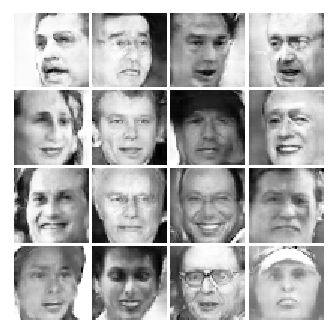
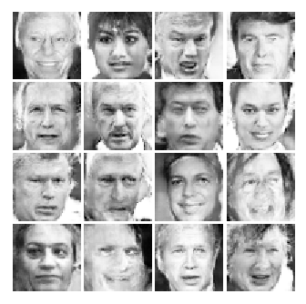
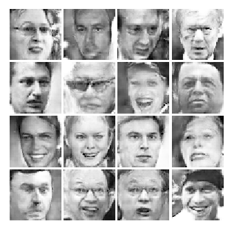
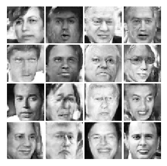

# Machine Learning Challenge 2017 Onsite Round Repository

[MLC2017 Onsite Round][mlc17]에 참여하면서 작성 및 훈련한 모델로, 100개의 noise를 입력받아 50x50 사이즈의 흑백 얼굴 사진을 생서하는 간단한 [DCGAN][dcgan]입니다.

트레이닝은 GTX1060을 이용해 수행하였습니다(평균 약 330 samples/sec).

## 생성된 결과(after 54020 training steps)

생성된 결과물을 고르지 않고 그냥 늘어놓으면 대충 이렇습니다.

[dcgan]: https://arxiv.org/abs/1511.06434
[mlc17]: https://korea.googleblog.com/2017/07/machine-learning-challenge.html
